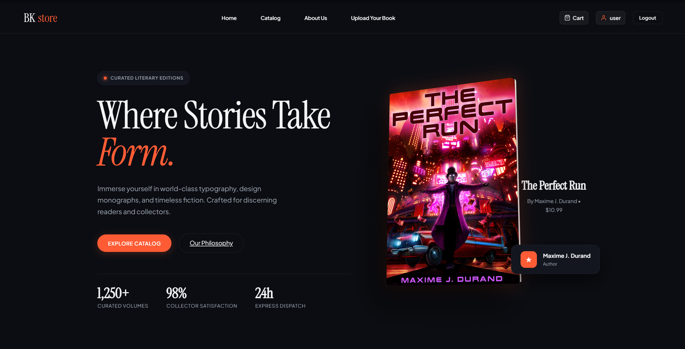
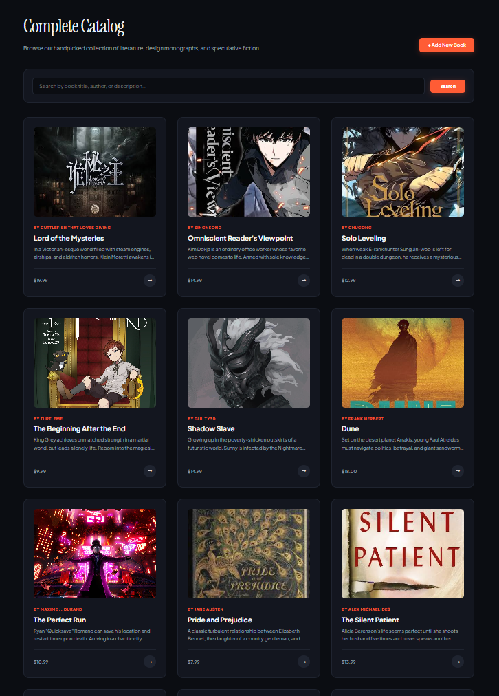
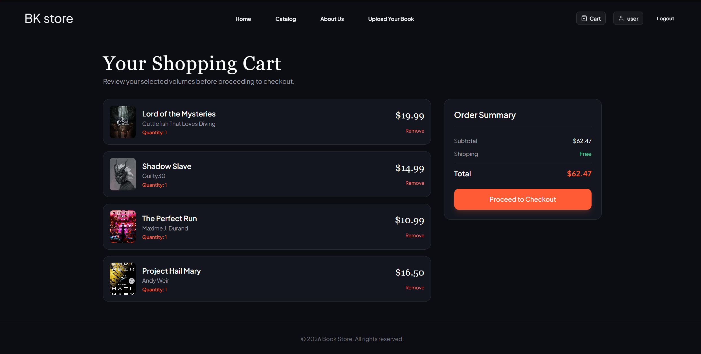
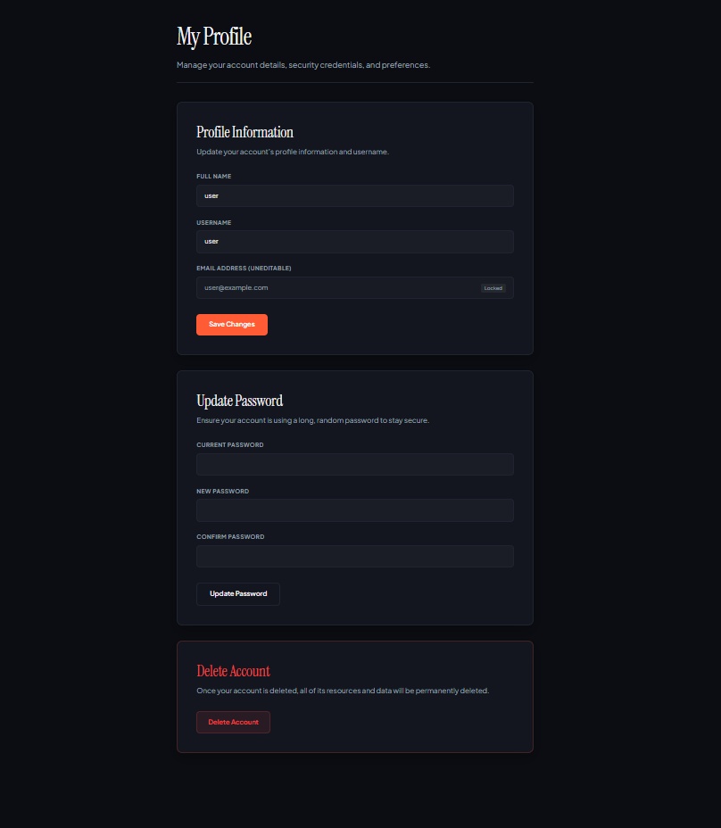

# Book Store Application

A modern, feature-rich bookstore web application built with **Laravel**. Discover, explore, and purchase your favorite books seamlessly with a clean interface, robust cart system, and personalized user profiles.

---

## 🌟 Application Previews

Here is a quick tour of the application interface:

### 1. Home Dashboard

*The main landing page featuring featured books, categories, and quick navigation.*

### 2. Catalog & Discovery

*Browse the extensive book collection with advanced filtering and search capabilities.*

### 3. Shopping Cart & Checkout

*Manage selected items, review pricing, and proceed through a streamlined checkout flow.*

### 4. User Profile & Management


*Personal account management, order history, and preferences.*

---

## 🚀 Features

- **Dynamic Catalog:** Browse books by genres, authors with lightning-fast search.
- **Interactive Shopping Cart:** Add, remove, and update quantities in real-time.
- **User Authentication & Profiles:** Secure login/register system with personalized dashboards and order history.
- **Responsive Design:** Fully optimized for desktop, tablet

---

## 🛠️ Tech Stack

- **Backend:** PHP / Laravel Framework
- **Database:** MySQL 
- **Frontend:** Blade Templates, Tailwind CSS , Modern CSS, JavaScript
- **Asset Management:** Vite / Laravel Mix

---

## ⚙️ Getting Started

Follow these instructions to set up the project locally on your machine.

### Prerequisites
- PHP >= 8.2
- Composer
- Node.js & NPM

### Installation

1. **Clone the repository:**
   ```bash
   git clone https://github.com/Midox42/book_store
   cd book_store
   ```

2. **Install PHP dependencies:**
   ```bash
   composer install
   ```

3. **Install JavaScript dependencies:**
   ```bash
   npm install
   ```

4. **Environment Setup:**
   ```bash
   cp .env.example .env
   php artisan key:generate
   ```

5. **Configure Database:**
   Update your database credentials in the `.env` file, then run migrations and seeders:
   ```bash
   php artisan migrate --seed
   ```

6. **Run the Development Server:**
   ```bash
   php artisan serve
   ```
   And compile frontend assets:
   ```bash
   npm run dev
   ```

---

## 📄 License

This project is open-source software licensed under the [MIT license](LICENSE).
